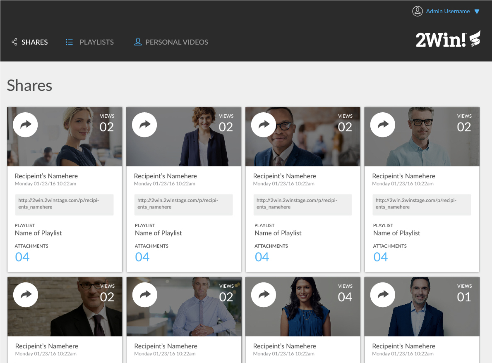
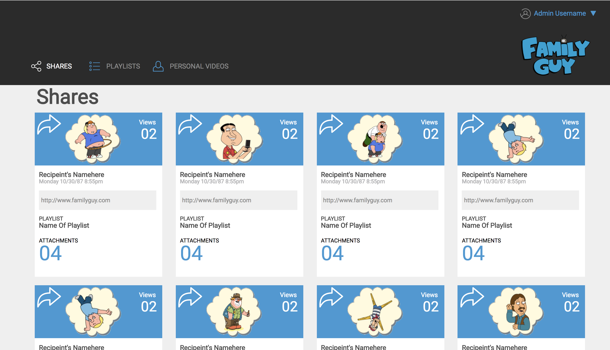

# EM-comp-challenge-2
I recreated a static comp that respects the integrity of the original design.  
By adding media brakes I was able to reorganize elements to fit the page according to the pixel width of the screen. 
My theme for the static comp is an app that will allow users to post they playlists and listen to other peoples playlist.

Static Comp Provided:

My Static Comp:

